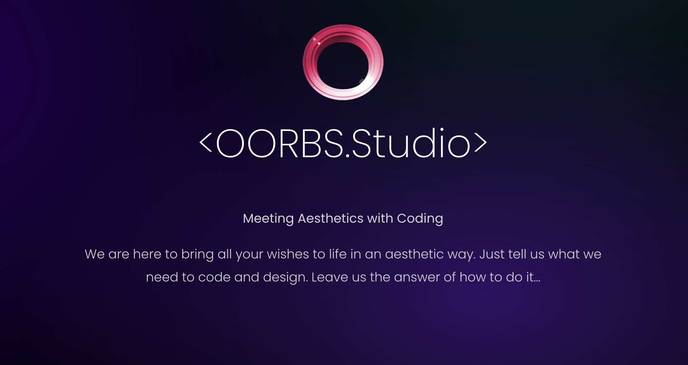

# OORBS

A Flutter project made by OORBS.Studio.

## Getting Started

FlutterFlow projects are built to run on the Flutter.

### IMPORTANT:

For projects with Firestore integration, you must first run the following commands to ensure the project compiles:

```
flutter pub get
flutter packages pub run build_runner build --delete-conflicting-outputs
```

This command creates the generated files that parse each Record from Firestore into a schema object.
